# Mango Tree modelling

The modelling of the mango tree will be inspired from the article:

- V-Mango: a functional–structural model of mango tree growth, development and fruit production. 2020. Boudon et al. Annals of Botany. [https://doi.org/10.1093/aob/mcaa089](https://doi.org/10.1093/aob/mcaa089)

Some extract of the publication to help you do the modelling is given below.
The tree is modeled as a collection of Growth Units, Inflorescences and Fruits.

## Organ Modelling

The main parameters of the Growth Unit are synthized in the following picture

The actual value can be found in the following table:

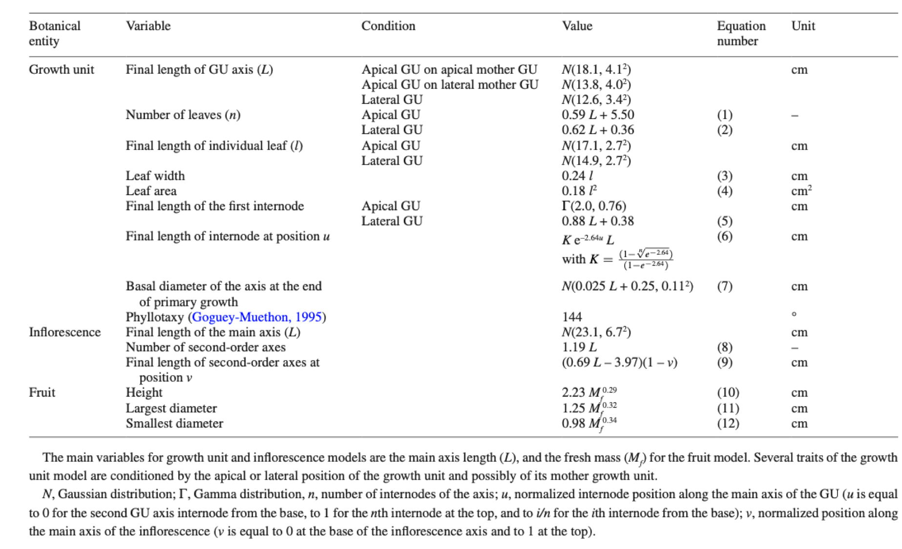

The growth of the organs are modelled using a logistic function that depend of thermal time.

$ l(tts) = \frac{L}{1+exp{\frac{tts-t_{ip}}{B}} $

whose parameters are given in the following table.

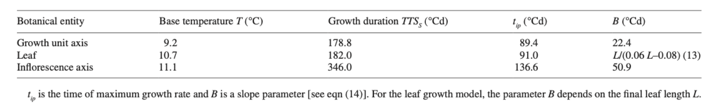

The development of the organs i.e. the change of phenological stages is also a fonction of thermal time and has varying base temperature for each stage.
Parameter of stage duration and base temperature are given in the following table.

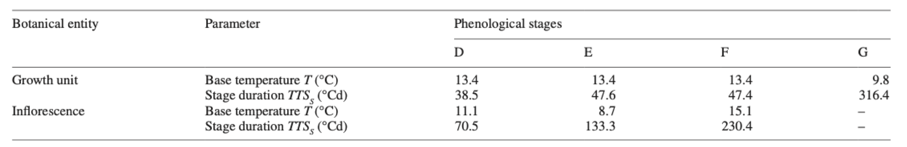

The phenological stages will change the color and the orientation of the leaves.
Reference value for leaf angles will be D:0, E:90,F:165,G:60,H:60.

As a result, something close to the following sequence should be achieved:

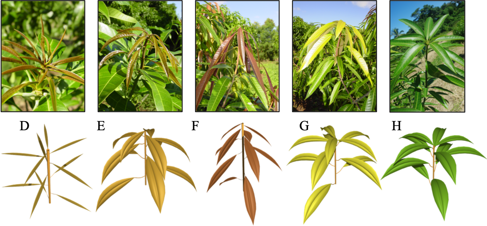

## Architecture Modelling

The burst of new botanical entities is controled by the following automata:

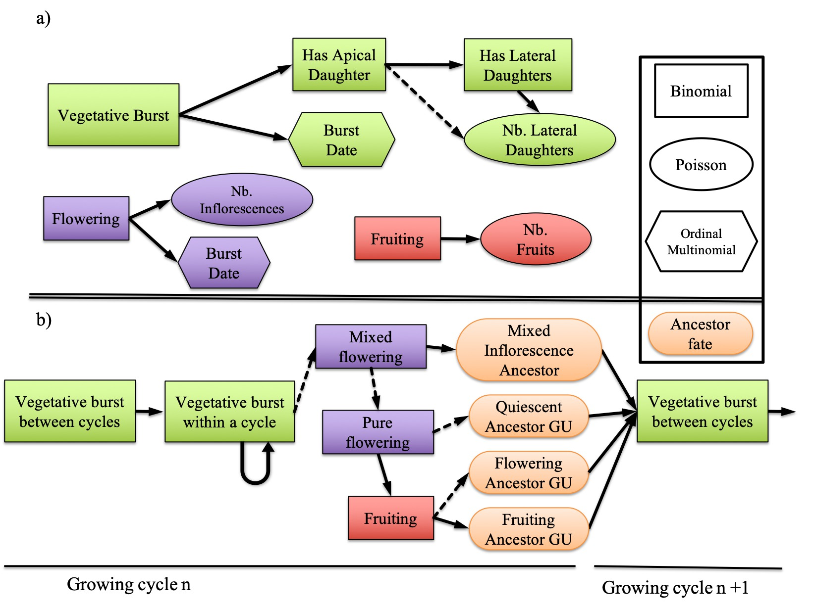

### Vegetative burst
The vegetative burst probability is dependent of the mother GU burst date and is given with the following diagram:

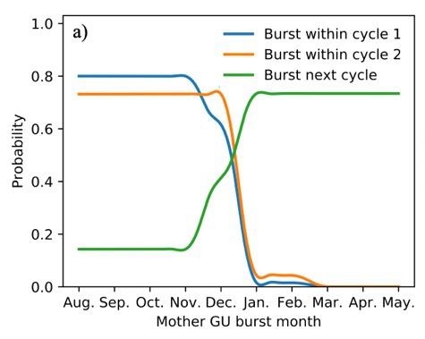

The burst probability of new GU at next cycle is managed separetly from the one within the same cycle.

### Apical and lateral daughters

GUs that produced daughter GUs within the same cycle had a high probability to produce an apical daughter GU (P = 0.98). Apical mother GUs had a higher probability to produce lateral daughter GUs (P = 0.66) than lateral mother GUs (P = 0.28) and, when they did, apical mother GUs produced a higher number of lateral daughter GUs than lateral mother GUs (on average, 2.1 vs. 1.3 for cycle 1, and 2.3 vs. 1.9 for cycle 2)

The production of GUs between growing cycles was strongly affected by the fate of the ancestor GUs. Only quiescent ancestor GUs could produce an apical daughter GU during the next growing cycle (P = 0.82) since the apical bud was transformed into an inflorescence for flowering and fruiting ancestor GUs. The probability of producing lateral daughter GUs for quiescent ancestor GUs was P = 0.46. The mean number of lateral daughter GUs depended on the fate and position of the ancestor GU. The flowering and fruiting ancestor GUs pro- duced more lateral daughter GUs (3.4 and 4.2, respectively) than quiescent ancestor GUs (2.4)

### Daughters burst date

The date of burst of the daughter depend on the date of burst of the mother. For the 2 cycles, the following information can be used.

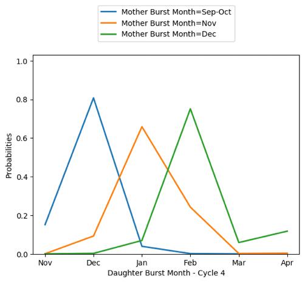
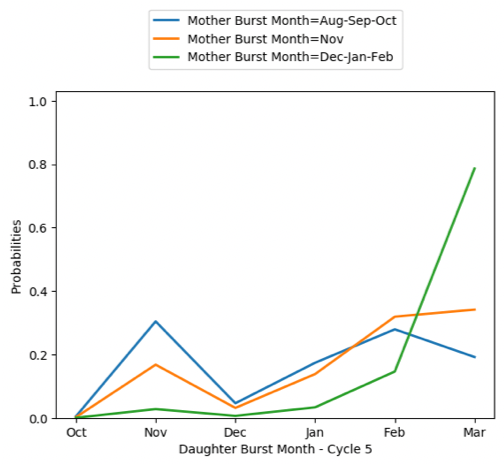

For between cycle, the prob. depend of the nature of the growth units following values can be used.

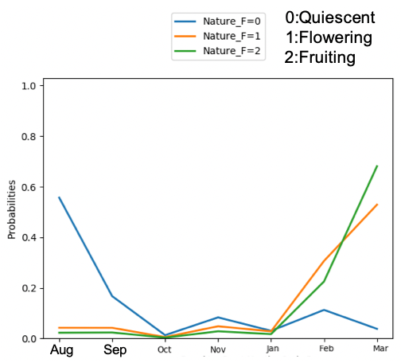

The probability to flower is again depend of the burst date of the mother GU.

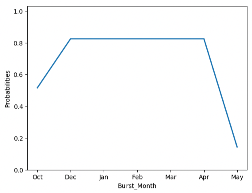

The number of inflorescences produced per terminal GU was usually one, except for GUs generated in December–January that produced an average of 1.6 inflorescences. The date of flowering of the inflorescences was recorded only during cycle 2, and most of the GUs flowered in September according to a two-peak pattern.

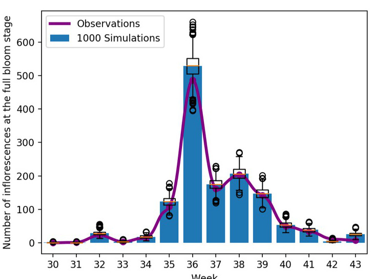
