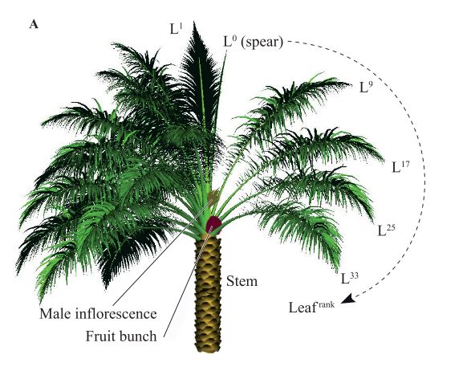
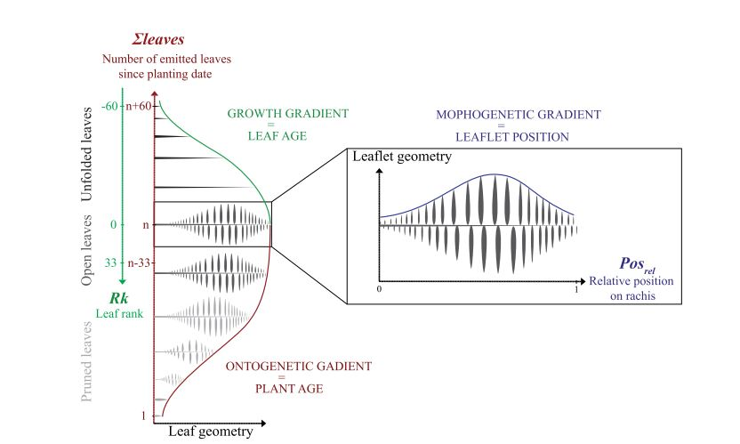
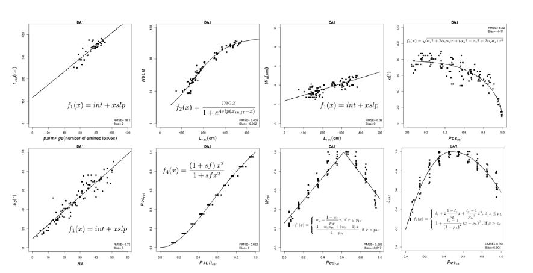
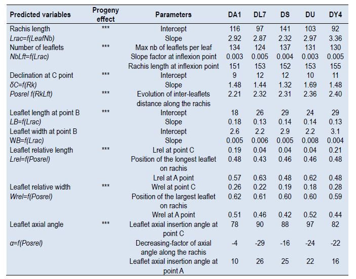

# Oil palm modelling

The modelling of the oil palm tree will be inspired from the articles:

Perez R, Pallas B, Griffon S, et al. Reconstructing three-dimensional oil palm architecture from allometric relationships. Acta Hortic. 2017;(1160):11-18. doi:10.17660/ActaHortic.2017.1160.3

Perez RPA, Pallas B, Le Moguédec G, et al. Integrating mixed-effect models into an architectural plant model to simulate inter- and intra-progeny variability: a case study on oil palm ( Elaeis guineensis Jacq.). J Exp Bot. 2016;67(15):4507-4521. doi:10.1093/jxb/erw203 Link to the article: https://academic.oup.com/jxb/article-lookup/doi/10.1093/jxb/erw203

## Botany and architecture

Oil palm is a perennial plant which architecture follows the Corner model, which is characterized by a mono- axial shoot (the stem) that produces phytomers in regular succession. Leaves are disposed according to a radial symmetry with a phyllotaxis varying from 135.7 to 137.5 degrees.Due to this regular phyllotaxis, it is possible to distinguish spi- rals of leaves (parastichies) and determine the order (rank) with which leaves were emitted. The order 8 parastichy is the reference to identify leaf rank. Leaf rank 1 is the youngest leaf fully open (unfolded) leaf at the top of the stem (leaves below rank one are called spears). As a result, the topological position of a leaf within the crown can be used to estimate its age.

Mature oil palm leaves are compound leaves with an even-pinnate arrangement. The leaf is composed by a petiole and a rachis that bears leaflets, also called pinnae. Both sides of the leaves have almost a similar number of leaflets but their disposition along the rachis is irregular. Reference points can be observed on rachis (A=leaf tip, B=transition shape of cross section  and C= transition between petiole and rachis). At adult stage, leaf length can reach 10 meters and bears approximately 250 to 350 leaflets.

## Modelling oil palm architetcure from allometric reationships

Some extract of the publication to help you do the modelling is given below. 
The architecture is modeled as a collection of allometric relationships, with three variables accounting for morphogenetic gradients: 

The allometric relationships can be found in the following figure:

and the associated parameters:

